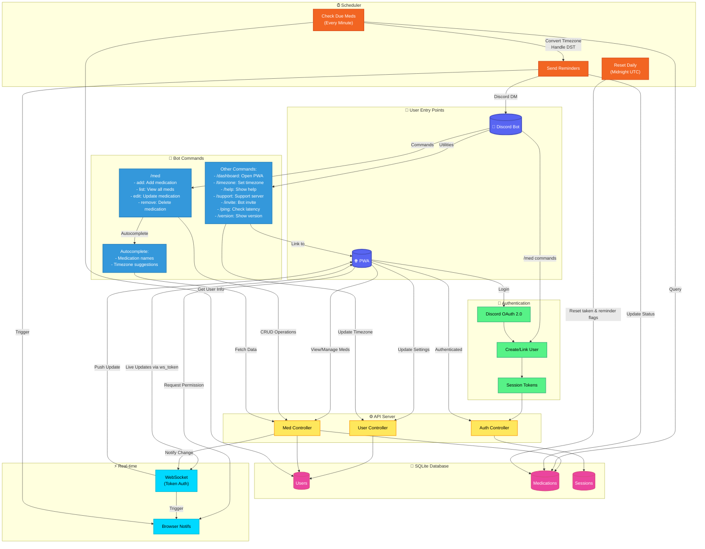

```mermaid
%% @license MIT
%% Copyright (c) 2025 Clove Twilight
%% See LICENSE file in the root directory for full license text.

%% Medication Reminder System - Complete Workflow
%% Version: PTB v1.0.5

graph TB
    %% User Entry Points
    subgraph Entry["🚪 User Entry Points"]
        PWA[("🌐 PWA")]
        Discord[("💬 Discord Bot")]
    end

    %% Authentication Flow
    subgraph Auth["🔐 Authentication"]
        OAuth["Discord OAuth 2.0"]
        CreateUser["Create/Link User"]
        Session["Session Tokens"]
    end

    %% Core API
    subgraph API["⚙️ API Server"]
        AuthAPI["Auth Controller"]
        UserAPI["User Controller"]
        MedAPI["Med Controller"]
    end

    %% Data Storage
    subgraph Storage["💾 SQLite Database"]
        UsersDB[("Users")]
        MedsDB[("Medications")]
        SessionsDB[("Sessions")]
    end

    %% Real-time & Notifications
    subgraph Realtime["⚡ Real-time"]
        WS["WebSocket<br/>(Token Auth)"]
        BrowserNotif["Browser Notifs"]
    end

    %% Scheduling System
    subgraph Scheduler["⏰ Scheduler"]
        CronCheck["Check Due Meds<br/>(Every Minute)"]
        CronReset["Reset Daily<br/>(Midnight UTC)"]
        SendReminder["Send Reminders"]
    end

    %% Discord Commands
    subgraph DiscordCommands["💬 Bot Commands"]
        MedCmd["/med<br/>- add: Add medication<br/>- list: View all meds<br/>- edit: Update medication<br/>- remove: Delete medication"]
        OtherCmd["Other Commands:<br/>- /dashboard: Open PWA<br/>- /timezone: Set timezone<br/>- /help: Show help<br/>- /support: Support server<br/>- /invite: Bot invite<br/>- /ping: Check latency<br/>- /version: Show version"]
        Autocomplete["Autocomplete:<br/>- Medication names<br/>- Timezone suggestions"]
    end

    %% User Interactions Flow
    PWA -->|Login| OAuth
    Discord -->|/med commands| CreateUser
    OAuth --> CreateUser
    CreateUser --> Session
    Session --> AuthAPI

    %% Dashboard & Bot Operations
    PWA -->|Authenticated| AuthAPI
    PWA -->|View/Manage Meds| MedAPI
    PWA -->|Update Settings| UserAPI
    PWA <-->|Live Updates via ws_token| WS
    PWA -->|Request Permission| BrowserNotif
    
    Discord -->|Commands| MedCmd
    Discord -->|Utilities| OtherCmd
    MedCmd -->|Autocomplete| Autocomplete
    MedCmd -->|CRUD Operations| MedAPI
    OtherCmd -->|Update Timezone| UserAPI
    OtherCmd -->|Link to| PWA
    Autocomplete -->|Fetch Data| MedAPI

    %% API to Storage
    AuthAPI --> SessionsDB
    UserAPI --> UsersDB
    MedAPI --> MedsDB
    MedAPI --> UsersDB

    %% Real-time Flow
    MedAPI -->|Notify Change| WS
    WS -->|Push Update| PWA
    WS -->|Trigger| BrowserNotif

    %% Scheduler Flow
    CronCheck -->|Query| MedsDB
    CronCheck -->|Get User Info| UsersDB
    CronCheck -->|Convert Timezone<br/>Handle DST| SendReminder
    SendReminder -->|Discord DM| Discord
    SendReminder -->|Update Status| MedsDB
    SendReminder -->|Trigger| BrowserNotif
    CronReset -->|Reset taken & reminder flags| MedsDB

    %% Visual Styling
    classDef entryPoint fill:#5865F2,stroke:#4752C4,stroke-width:3px,color:#fff
    classDef auth fill:#57F287,stroke:#43B581,stroke-width:2px,color:#000
    classDef api fill:#FEE75C,stroke:#FAA61A,stroke-width:2px,color:#000
    classDef storage fill:#EB459E,stroke:#D84A7F,stroke-width:2px,color:#fff
    classDef realtime fill:#00D9FF,stroke:#00B8D4,stroke-width:2px,color:#000
    classDef scheduler fill:#F26522,stroke:#D94F1C,stroke-width:2px,color:#fff
    classDef commands fill:#3498DB,stroke:#2980B9,stroke-width:2px,color:#fff

    class PWA,Discord entryPoint
    class OAuth,CreateUser,Session auth
    class AuthAPI,UserAPI,MedAPI api
    class UsersDB,MedsDB,SessionsDB storage
    class WS,BrowserNotif realtime
    class CronCheck,CronReset,SendReminder scheduler
    class MedCmd,OtherCmd,Autocomplete commands
```