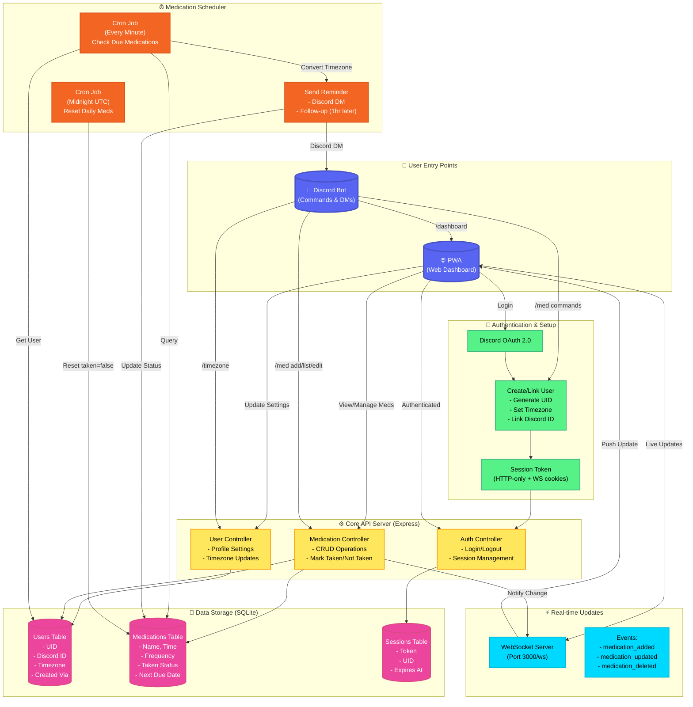

```mermaid

%% @license MIT
%% Copyright (c) 2025 Clove Twilight
%% See LICENSE file in the root directory for full license text.

%% Medication Reminder System - Complete Workflow
%% Version: PTB v1.0.4

graph TB
    %% User Entry Points
    subgraph Entry["🚪 User Entry Points"]
        PWA[("🌐 PWA<br/>(Web Dashboard)")]
        Discord[("💬 Discord Bot<br/>(Commands & DMs)")]
    end

    %% Authentication Flow
    subgraph Auth["🔐 Authentication & Setup"]
        OAuth["Discord OAuth 2.0"]
        CreateUser["Create/Link User<br/>- Generate UID<br/>- Set Timezone<br/>- Link Discord ID"]
        Session["Session Token<br/>(HTTP-only + WS cookies)"]
    end

    %% Core API
    subgraph API["⚙️ Core API Server (Express)"]
        AuthAPI["Auth Controller<br/>- Login/Logout<br/>- Session Management"]
        UserAPI["User Controller<br/>- Profile Settings<br/>- Timezone Updates"]
        MedAPI["Medication Controller<br/>- CRUD Operations<br/>- Mark Taken/Not Taken"]
    end

    %% Data Storage
    subgraph Storage["💾 Data Storage (SQLite)"]
        UsersDB[("Users Table<br/>- UID<br/>- Discord ID<br/>- Timezone<br/>- Created Via")]
        MedsDB[("Medications Table<br/>- Name, Time<br/>- Frequency<br/>- Taken Status<br/>- Next Due Date")]
        SessionsDB[("Sessions Table<br/>- Token<br/>- UID<br/>- Expires At")]
    end

    %% Real-time Communication
    subgraph Realtime["⚡ Real-time Updates"]
        WS["WebSocket Server<br/>(Port 3000/ws)"]
        WSEvents["Events:<br/>- medication_added<br/>- medication_updated<br/>- medication_deleted"]
    end

    %% Scheduling System
    subgraph Scheduler["⏰ Medication Scheduler"]
        CronCheck["Cron Job<br/>(Every Minute)<br/>Check Due Medications"]
        CronReset["Cron Job<br/>(Midnight UTC)<br/>Reset Daily Meds"]
        SendReminder["Send Reminder<br/>- Discord DM<br/>- Follow-up (1hr later)"]
    end

    %% User Interactions Flow
    PWA -->|Login| OAuth
    Discord -->|/med commands| CreateUser
    OAuth --> CreateUser
    CreateUser --> Session
    Session --> AuthAPI

    %% Dashboard Operations
    PWA -->|Authenticated| AuthAPI
    PWA -->|View/Manage Meds| MedAPI
    PWA -->|Update Settings| UserAPI
    PWA <-->|Live Updates| WS

    %% Discord Bot Operations
    Discord -->|/med add/list/edit| MedAPI
    Discord -->|/timezone| UserAPI
    Discord -->|/dashboard| PWA

    %% API to Storage
    AuthAPI --> SessionsDB
    UserAPI --> UsersDB
    MedAPI --> MedsDB
    MedAPI --> UsersDB

    %% WebSocket Flow
    MedAPI -->|Notify Change| WS
    WS -->|Push Update| PWA

    %% Scheduler Flow
    CronCheck -->|Query| MedsDB
    CronCheck -->|Get User| UsersDB
    CronCheck -->|Convert Timezone| SendReminder
    SendReminder -->|Discord DM| Discord
    SendReminder -->|Update Status| MedsDB
    
    CronReset -->|Reset taken=false| MedsDB

    %% Visual Styling
    classDef entryPoint fill:#5865F2,stroke:#4752C4,stroke-width:3px,color:#fff
    classDef auth fill:#57F287,stroke:#43B581,stroke-width:2px,color:#000
    classDef api fill:#FEE75C,stroke:#FAA61A,stroke-width:2px,color:#000
    classDef storage fill:#EB459E,stroke:#D84A7F,stroke-width:2px,color:#fff
    classDef realtime fill:#00D9FF,stroke:#00B8D4,stroke-width:2px,color:#000
    classDef scheduler fill:#F26522,stroke:#D94F1C,stroke-width:2px,color:#fff

    class PWA,Discord entryPoint
    class OAuth,CreateUser,Session auth
    class AuthAPI,UserAPI,MedAPI api
    class UsersDB,MedsDB,SessionsDB storage
    class WS,WSEvents realtime
    class CronCheck,CronReset,SendReminder scheduler
```